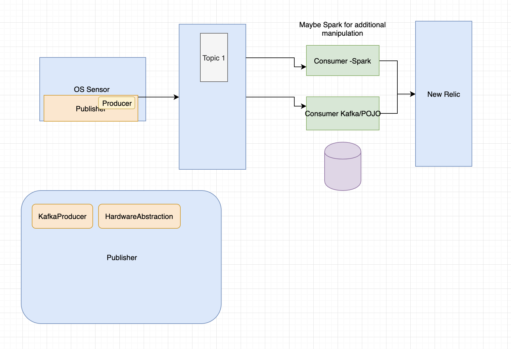
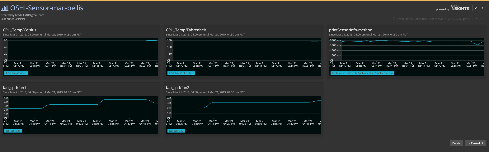

# SensorMonitoringService





This service collects hardware information using OSHI APIs

Poll each metric once per second for the following metrics:

Fan Speed rpm\n
CPU Voltage (if provided by the OS)\n
CPU Temp in F and C\n

The main branch is currently (3/21) a proof of concept.  Each metric above is gathered during one method that runs in main.

I need create a design that can be more easily extended.  Check branches for work in progress.


The only dependency as of now (3/21) is oshi-core.

Added a Kafka producer to send metrics through Kafka first.  

Next up is to create a generic consumer and send metrics to a db.

Visualize via DB.

Additionally, will have a second consumer that pulls metrics from topic and sends straight to New Relic.


The UI for this is New Relic.  I'm using the Java Agent and custom instrumentation with the ```@Trace``` annotations and ```NewRelic.recordMetric()```.  I may decide to fork oshi core and build the instrumentation directly into core for deeper.
I could also just use XML or or CIE in NR to get deeper visibility.  Or build a custom extension in-house NR. Which I would not be able to publish here.



