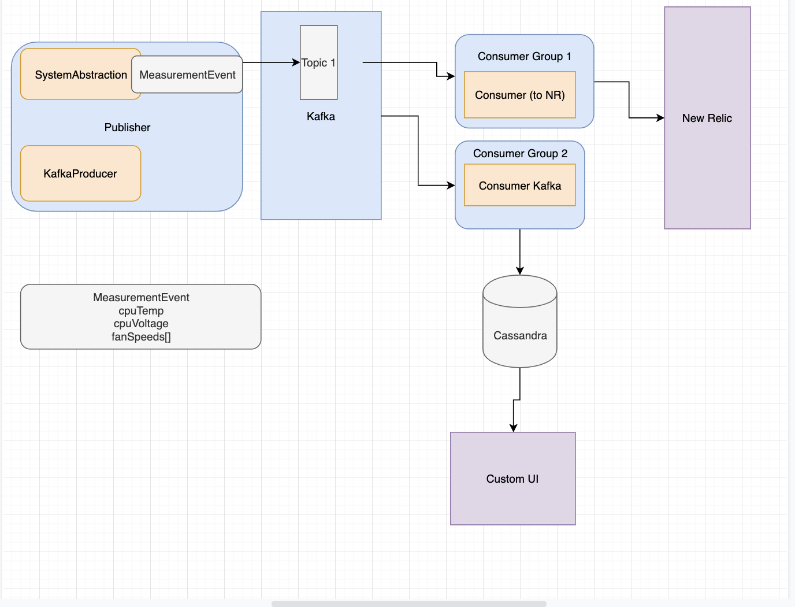

# SensorMonitoringService

This diagram is a hint at the direction this project is going (it needs some updates to the consumer layout).  Much of it is experimental in effort to learn Kafka.
I'll build two different consumers. One will send to New Relic after getting metrics from the Kafka topic.
The second consumer will be to put metrics into an on-prem style timeseries database.  I'll build a small UI to visualize that data.

This service collects hardware information using OSHI APIs that are built into a computer system abstraction. 

Poll each metric once per second for the following metrics:

Fan Speed rpm

CPU Voltage (if provided by the OS)

CPU Temp in C.  Any changes to metrics (i.e. conversions) will be completed on the consumer side.
Added a Kafka producer to send metrics through Kafka first. 

Next up is to create a generic consumer and send metrics to a db.

Visualize via DB.

Additionally, will have a second consumer that pulls metrics from topic and sends straight to New Relic.

